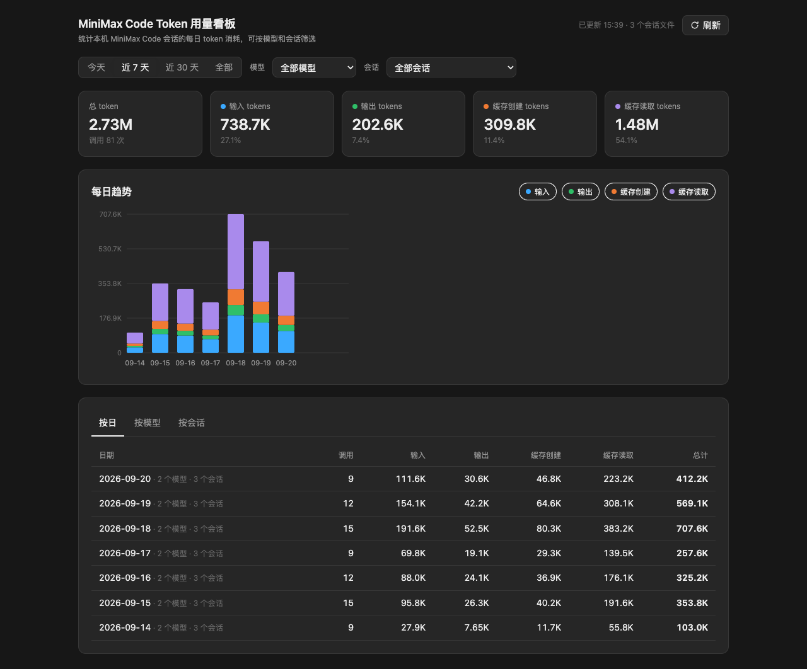

# Token 用量看板

[English](README.md) | 简体中文

查看本机 MiniMax Code 每日 Token 用量，支持按时间、模型和会话筛选，并查看按日、按模型、按会话的汇总。

作者：[amszuidas](https://github.com/amszuidas) · 版本：`1.0.0`



*预览中的会话和用量均为合成数据。*

## 安装与使用

将本目录完整复制到 MiniMax Code 当前数据目录下。`<dataDir>` 默认为用户主目录下的 `.minimax`，即 `~/.minimax`，因此默认安装路径为 `~/.minimax/plugins/mcode-token-usage-board/`。如果你配置了其他数据目录，请使用实际配置的路径：

```text
<dataDir>/plugins/mcode-token-usage-board/
```

保留 `.minimax-plugin` 隐藏目录。重新启动支持 MiniApp 的 MiniMax Code，确认插件已被识别并启用，然后打开“Token 用量看板”，或在对话中请求“打开 Token 用量看板”。

页面支持今天、近 7 天、近 30 天和全部时间范围，可按模型、会话筛选。点击“刷新”更新数据；页面也会每 60 秒自动刷新。无需 API Key 或额外安装依赖。

## 数据与统计口径

服务从 Host 注入的 `context.dataDir` 向上寻找 `v2/sessions`；未找到时回退到用户目录下的 `.minimax/v2/sessions`。它读取会话目录中的 `manifest.json` 和 `messages.jsonl`，提取用量、模型、会话 ID 和首条有效用户文本生成的标题。

统计按本机时区分日，总量是输入、输出、缓存读取、缓存创建四项之和，不能直接当作官方计费 Token 或账单。此插件依赖客户端的会话文件格式，缺少用量字段或格式变化可能导致统计不完整。

运行代码不写本地文件、不向外部服务上传数据，无遥测和凭据配置；缓存仅保存在进程内存中。页面会展示真实会话标题，请留意截图和屏幕分享中的私人信息。

## 源码与验证

页面位于 `miniapp/client/index.html`，Node 服务位于 `miniapp/node/server.mjs`，无需构建。

本次收录已用合成会话验证服务汇总、数据刷新、错误处理和服务关闭，并完成浏览器页面预览。尚未完成真实 MiniMax Code 桌面端安装验证，最低兼容版本和跨系统兼容性待确认。

## 许可证

[MIT](LICENSE)。
